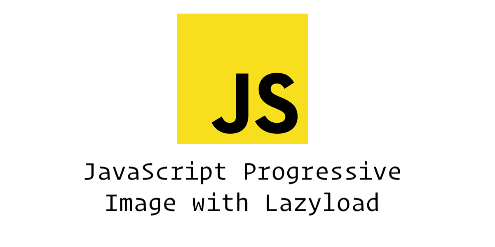

## Progressive Image JS


[Demo](https://progressive-image.js.arnoldfederis.com)

### Progressive image with Lazyload

### Install in `npm` or `yarn`

```
$ npm install progressive-image-lazyload.js

$ yarn add progressive-image-lazyload.js
```


### How to use

* `HTML` markup

```html
<figure class="graf-figure">
    <div class="aspectRatioPlaceholder">
        <div class="aspectRatioPlaceholder-fill"></div>
        <div class="progressiveMedia" data-width="1920" data-height="1080">
            
            <canvas class="progressiveMedia-canvas"></canvas>
            
        </div>
    </div>
</figure>
```

* In `HTML` put this line of code inside your `<head>` tag

```html
<link rel="stylesheet" href="dist/progressive-image.css">
<script type="text/javascript" src="dist/index.js"></script>
```

* In `JavaScript` and `SCSS` using npm or yarn

```scss
/* SCSS */
@import "~progressive-image-lazyload.js/src/scss/progressive-image";
```

```javascript
/* JavaScript */
import 'progressive-image-lazyload.js'
```

* `data-thumb` this is where you set your small image.
* `data-src` this is where you set your large image.
